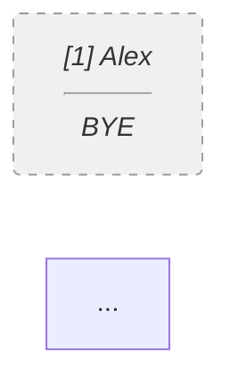

# Tournament Bracket Generator with Mermaid

This library provides utilities for generating single-elimination tournament brackets with automated BYE handling and Mermaid diagram generation. It supports up to 20 competitors in a 32-slot bracket format.

## Usage

```javascript
import { generateBracket } from './mermaid.js';

// Create competitor list (up to 20 entrants)
const competitors = [
  { seed: 1, name: 'Alex' },
  { seed: 2, name: 'Bailey' },
  { seed: 3, name: 'Casey' },
  // ...up to 20 competitors
];

// Generate the bracket
const { slots, mermaid } = generateBracket(competitors);

// Use the mermaid string in Markdown
console.log(mermaid);
```

## Seeding Algorithm

The implementation uses standard 32-slot balanced seeding (bit-reverse order) to ensure top seeds are separated and only meet in later rounds based on their performance:

```
[1,32,16,17,8,25,9,24,4,29,13,20,5,28,12,21,2,31,15,18,7,26,10,23,3,30,14,19,6,27,11,22]
```

This seeding pattern provides several benefits:

1. **Balanced Distribution**: Top seeds are distributed evenly throughout the bracket
2. **Delayed Matchups**: Higher-ranked competitors only face each other in later rounds
3. **Reward for Higher Seeds**: Top seeds get more favorable paths

The bit-reverse algorithm effectively positions the competitors so that (assuming no upsets):
- Seed 1 and Seed 2 would only meet in the final
- Seed 1 and Seeds 3-4 would only meet in the semifinals
- Seed 1 and Seeds 5-8 would only meet in the quarterfinals

## BYE Logic

When there are fewer than 32 competitors, the system automatically fills the remaining slots with BYEs:

1. Any seed position > N (where N is the number of competitors) becomes a BYE
2. Competitors automatically advance when paired against a BYE
3. BYEs are styled differently in the Mermaid diagram (dashed lines, italics)
4. Top seeds are prioritized to receive BYEs in the first round when possible

For example, with 20 competitors, positions 21-32 in the seeding array become BYEs, ensuring the bracket remains balanced.

## Embedding in Markdown

The `generateMermaidBracket` function returns a string that can be directly pasted into any Markdown document that supports Mermaid, including:

- GitHub
- GitLab
- Notion
- Documentation sites using Mermaid (e.g., Docusaurus, VuePress)

Example Markdown:

```markdown
# Tournament Results

Here's the bracket for our tournament:



## Customizing the Visualization

### Show/Hide Seeds

You can toggle the display of seed numbers with the `showSeeds` option:

```javascript
// Without seed numbers
const { mermaid } = generateBracket(competitors, { showSeeds: false });
```

### CSS Styling

For platforms that support CSS customization of Mermaid diagrams, you can use this snippet to highlight the champion node and improve the overall appearance:

```css
.mermaid .champion rect {
  fill: #e6f7ff !important;
  stroke: #0066cc !important;
  stroke-width: 3px !important;
}

.mermaid .competitor rect {
  fill: #f9f9f9;
  stroke: #333;
  stroke-width: 1px;
}

.mermaid .bye rect {
  fill: #f0f0f0;
  stroke: #999;
  stroke-width: 1px;
  stroke-dasharray: 5,5;
}

.mermaid .edgePath .path {
  stroke: #333;
  stroke-width: 1.5px;
}

/* Add a trophy icon to champion node */
.mermaid .champion .label::before {
  content: "🏆 ";
}
```

To use this styling:

1. Add the CSS to your document or stylesheet
2. In your final tournament display, add the "champion" class to the final winner's node

## Error Handling

The library includes robust validation:

- Throws `RangeError("Division cap exceeded")` if more than 20 competitors
- Throws `TypeError` if seeds are not unique or not in the range 1...N

## Unit Testing

Run tests with:

```bash
npm test
```

The test suite verifies:
- Correct BYE counts for different numbers of competitors
- Seed 1 never faces a live competitor before R16 when BYEs exist
- Proper Mermaid syntax and structure
- Error handling for edge cases